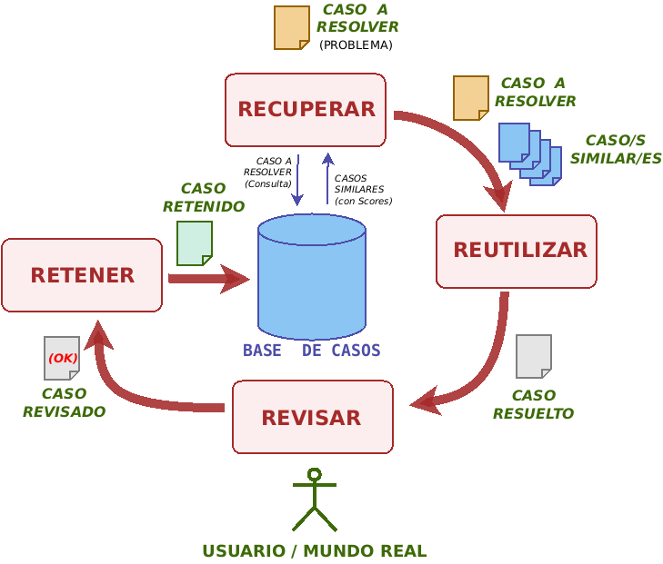
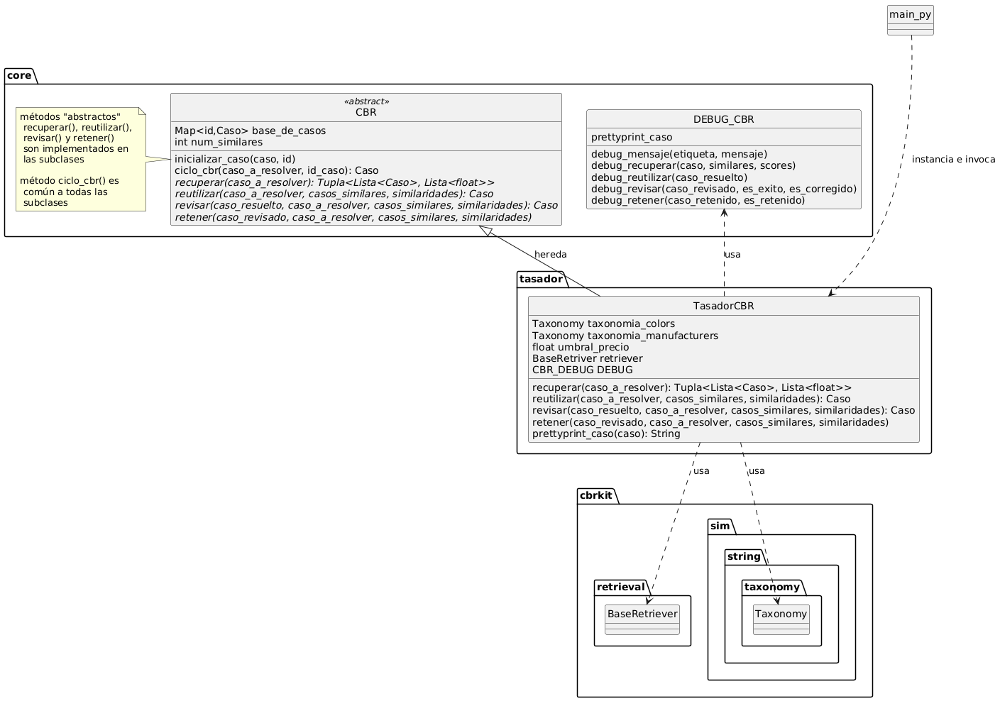

# SIEX 24/25. Ejemplo de sistema CBR (Razonamiento Basado en Casos)


[TOC]

Ejemplo de una herramienta de tasación de coches usados a partir de sus características (marca y modelo, color, millas, etc) utilizando razonamiento basado en casos.

- Emplea un "mimiframework" que estructura las fases del ciclo CBR (recuperar, reutilizar, revisar, retener)

- Hace uso de la [librería CBRKit](https://github.com/wi2trier/cbrkit/)  para (1) la carga y gestión de la base de casos y para (2) la implementación de las métricas de similaridad utilizadas en la fase`recuperar`


## 1. Dependencias y ejecución del proyecto

### 1.1 Dependencias

CBRKkt es un proyecto en desarrollo y la librería está en cambio constante. Para este ejemplo y para la realización de la práctica de CBR se ha trabajará con la **versión 0.14.2** (la última compatible con Python 3.11, [código fuente descargable](https://github.com/wi2trier/cbrkit/archive/refs/tags/v0.14.2.zip))

```sh
$ pip install -r requirements.txt
```

ó

```sh
$ pip install cbrkit[nlp]==0.14.2
$ pip install argparse
```

**Nota:** Para utilizar las métricas de similaridad entre Strings basadas en modelos de lenguaje es necesario instalar módulos adicionales de `cbrkit`
- `cbrkit[transformers]` para utilizar los modelos de la librería [`sentence-transformers`](https://sbert.net/) 
- `cbrkit[llm]` para utilizar  las APIs de OpenIA y similares


### 1.2 Ejecución
#### Descarga desde github

- Clonado del proyecto con el comando `git`
    ```sh
    git clone https://github.com/esei-si-dagss/tasador-24.git
    cd tasador-24
    ```
- Descarga directa del proyecto comprimido en ZIP (desde (https://github.com/esei-si-dagss/tasador-24/archive/refs/heads/main.zip))
    ```sh
    wget https://github.com/esei-si-dagss/tasador-24/archive/refs/heads/main.zip
    unzip main.zip
    cd tasador-24-main
    ```

#### Ejemplo de ejecución
- Parámetros de línea de comandos
    ```sh
    python main.py --help
    usage: main.py [-h] [-b BASE_CASOS] [-r CASOS] [-c COLORES] [-f FABRICANTES] [-n NUM_SIMILARES] [-u UMBRAL_PRECIO] [-d]
    
    Ejemplo de uso del modelo CBR para tasaciones de coches
    
    options:
      -h, --help            show this help message and exit
      -b BASE_CASOS, --base_casos BASE_CASOS
                            Path al fichero JSON con la base de casos (lista de objetos coche)
      -r CASOS, --casos CASOS
                            Path al fichero JSON con los casos a resolver (lista de objetos coche)
      -c COLORES, --colores COLORES
                            Path al fichero YAML con la taxonomia de colores
      -f FABRICANTES, --fabricantes FABRICANTES
                            Path al fichero YAML con la taxonomia de fabricantes
      -n NUM_SIMILARES, --num_similares NUM_SIMILARES
                            Num. de casos similares a utilizar
      -u UMBRAL_PRECIO, --umbral_precio UMBRAL_PRECIO
                            porcentaje de error en el precio predicho admitido como correcto en la fase Revision
      -d, --debug           Activar DEBUG de fases del ciclo CBR
    ```
- Procesamiento del fichero de casos `datos/casos_a_resolver.json` (con DEBUG activado)
    ```sh
    python main.py --base_casos datos/base_de_casos.json \
                   --casos datos/casos_a_resolver.json \
                   --colores datos/paint_color.yaml \
                   --fabricantes datos/cars-taxonomy.yaml \
                   --num_similares 10 --umbral_precio 5 --debug
    ```
    Carga la base de casos de ejemplo y procesa los 20 casos (coches) del fichero `datos/casos_a_resolver.json`. 
    - Para definir la similaridad entre casos se cargan los dos ficheros con taxonomías (colores y fabricantes) disponibles
    - En la fase `reutilizar` se usan 10 casos similares para predecir el precio del coche descrito en el caso a resolver
    - En la fase `revisar` se considera que la predicción fue exitosa si la diferencia entre el precio predico y el precio real es menor al 5%


### 1.3 Estructura del proyecto

```sh
$ tree tasador-24
datos
├── cars-1k.original.json
├── base_de_casos.json
├── casos_a_resolver.json
├── cars-taxonomy.yaml
└── paint_color.yaml
core.py 
tasador.py 
main.py 
dividir_base_casos_json.py 
README.md
```
El **directorio `datos` **contiene ficheros de ejemplo para la ejecución del "tasador" de vehículos:

- `cars-1k.original.json`: base casos empleada en los ejemplos y la demo de CBRKit ([enlace](https://github.com/wi2trier/cbrkit-demo)) [almacena los casos como un array de objetos JSON que será cargado con [`cbrkit.loaders.json()`](https://wi2trier.github.io/cbrkit/cbrkit/loaders.html)]
  - cada **caso** es un objeto JSON con la siguiente estructura:

    ```json
    {
    "engine": {
      "drive": "rwd",
      "fuel": "gas",
      "transmission": "manual"
    },
    "miles": 150000,
    "model": {
      "make": "xsara",
      "manufacturer": "citroen"
    },
    "paint_color": "black",
    "price": 1295,
    "title_status": "clean",
    "type": "compact",
    "year": 1360
    }
    ```
  
- `base_casos.json`: porción de la base de casos`cars-1k.original.json` excluyendo los casos de `casos_a_resolver.json`

- `casos_a_resolver.json`: 20 casos tomados de `cars-1k.original.json` para ser usados como entrada al tasador

- `cars-taxonomy.yaml`: taxonomía de fabricantes de vehículos, utilizada para calcular la similaridad entre fabricantes [en formato YAML para ser cargado con [`cbrkit.sim.strings.taxonomy.load()`](https://wi2trier.github.io/cbrkit/cbrkit/sim/strings/taxonomy.html)]

- `paint-colot.yaml`: taxonomía de colores, utilizada para calcular la similaridad entre colores de pintura

El **fichero `core.py`** define un "miniframework" que encapsula las fases del ciclo básico de los sistemas CBR en la clase `CBR`.  

- La clase `CBR` es el equivalente a una "clase abstracta" de Java que implementa el método `ciclo_cbr()` delegando las fases del ciclo CBR a métodos "abstractos" `recuperar()`,  `reutilizar()`, `revisar()` y `retener()` que tendrán que ser implementados por las subclases concretas.
- Incluye  también una clase de utilidad, `CBR_DEBUG`, que implementa la traza por pantalla de las fases CBR

El **fichero `tasador.py`** incluye la implementación del tasador de vehículos en una clase `TasadorCBR` 

- Es una clase que hereda de `core.CBR` y proporciona implementaciones de las fases del ciclo CBR utilizando parte de las funcionalidades de CBRKit

El **fichero `main.py`** ofrece un ejemplo de uso de la clase `TasadorCBR`: carga la base de casos, crea y configura una instancia de `TasadorCBR` y la alimenta con los casos a resolver (coches a tasar)

El **fichero `*dividir_base_casos_json.py`** es un script de utilidad que a partir de una base de casos almacenada como array JSON extrae una serie de casos a resolver al azar y crea otra base de casos sin incluirlos.

### 1.4 Documentación online de CBRkit v. 0.14.2 (extra)
CBRkit está en desarrollo y el API de la librería cambia con frecuencia. - En este ejemplo (y en el entregable) se propone usar la versión 0.14.2 de mediados de octubre de 2024.
- La [documentación oficial de CBRkit](https://wi2trier.github.io/cbrkit/cbrkit.html) describe los componentes de la última versión publicada en GitHub

CBRkit usa la herramienta [pdoc](https://pdoc.dev/) para generar la documentación online a partir del código fuente. Es posible instalar `pdoc`  (con `pip install pdoc`) y descargar el código fuente de la versión 0.14.2 para ver su documentación con el comando `pdoc`
```sh
$ pip install pdoc

$ wget https://github.com/wi2trier/cbrkit/archive/refs/tags/v0.14.2.zip)
$ unzip v0.14.2.zip

$ cd cbrkit-0.14.2
$ pdoc cbrkit            #  ó $HOME/.local/bin/pdoc cbrkit
```

En la URL `http://localhost:8080` estará disponible la documentación online de la versión 0.14.2 de CBRkit.


## 2. Tareas propuestas (no entregable)

**Tarea 1.** Análisis del ejemplo
1. Repasar la explicación de CBRkit de la Sección 3 y del "miniframework" CBR de la Sección 4
2. Revisar la organización del código del proyecto, prestando atención a:
   - Identificar las **responsabilidades** comunes (implementadas en la clase "abstracta" `core.CBR`) y las específicas del dominio de la tasación de vehículos (implementadas en la clase "hija" `tasador.TasadorCBR`) 	
   - Revisar las **métricas de similaridad** definidas en el método `inicializar_retriever()` de `tasador.TasadorCBR` y consultar sus características en la [documentación de CBRkit](https://wi2trier.github.io/cbrkit/cbrkit.html)
   - Revisar el fichero `main.py` para ver el modo de uso de los componentes del proyecto


**Tarea 2.** Modificar métricas de similaridad
1. Modificar los parámetros y/o añadir métricas de similaridad alternativas en el método `inicializar_retriever()` de `tasador.TasadorCBR`
2. Probar el efecto que tiene en los `casos_a_resolver.json` de muestra ejecutando `main.py`

**Tarea 3.** Mejorar la fase `reutilizar()`
1. Porporcionar una implementación alternativa del método `reutilizar()` de `tasador.TasadorCBR`
   - Reemplazar la media simple de la implementación original por una media ponderada que tenga en cuenta los valores de similaridad de los `casos_similares`
2. Variar el número de casos similares a extraer (establecido en `main.py` al llamar al constructor de `tasador.TasadorCBR`)
3. Probar el efecto que tiene en los `casos_a_resolver.json` de muestra


## 3. Uso de CBRkit

CBRkit es un toolkit modular en Python para el Razonamiento Basado en Casos. Actualmente se encuentra en desarrollo y en su versión actual permite cargar casos, definir medidas de similitud y realizar la recuperación sobre bases de casos en memoria. 

Más detalles: 

- [Codigo y descarga](https://github.com/wi2trier/cbrkit/) (descarga de la [versión 0.14.2](https://github.com/wi2trier/cbrkit/archive/refs/tags/v0.14.2.zip)))
- [Documentación](https://wi2trier.github.io/cbrkit/cbrkit.html)
- [Paper](https://www.mirkolenz.com/static/ca607f149265ea90aea9579bd78a04bc/Lenz2024CBRkitIntuitiveCaseBased.pdf) y [video](https://www.youtube.com/watch?v=27dG4MagDhE) de presentación

### 3.1 Resumen CBRkit

- [Resumen CBRkit (v. 0.14.2)](doc/resumen_cbrkit.md) [[pdf](doc/resumen_cbrkit.pdf)]


## 4. Uso del "miniframework" CBR

### 4.1 Módulo `core.py`

El módulo `cbr.py` establece una estructura básica para implementar un sistema de Razonamiento Basado en Casos (CBR).
-  La clase `CBR` define y estructura las fases principales del **ciclo CBR** y sirve como base para implementaciones concretas del ciclo CBR adaptadas a problemas específicos.
- La clase `CBR_DEBUG` permite la depuración en cada paso del ciclo, proporcionando mensajes sobre el estado del caso a resolver a medida que se avanza en las fases del proceso de razonamiento.


#### Clase `CBR`

La **clase `CBR`** implementa el **ciclo básico** de Razonamiento Basado en Casos, encargándose de manejar la base de casos y coordinando la ejecución de las fases **recuperar**, **reutilizar**, **revisar** y **retener** sobre el caso a resolver. 

- La clase `CBR` implementa el ciclo CBR y deben ser las clases que hereden de `CBR` las que aporten la lógica para implementar las 4 fases del ciclo CBR adaptadas al problema concreto que resuelvan.

  

##### Métodos de la clase `CBR`

1. **Constructor [`__init__(base_de_casos, num_casos_similares)`]**: Inicializa una instancia de la clase `CBR` con una base de datos de casos (`base_de_casos`) y un número predeterminado de casos similares a recuperar (`num_casos_similares`)
2. **`ciclo_cbr(caso_a_resolver, id_caso)`**: Implementa el **ciclo principal del CBR**, que recorre todas las fases: (1) inicializa el `caso_a_resolver`, (2) recupera los `casos_similares`, (3) reutiliza el conocimiento para resolver el caso, (4) revisa la solución propuesta y (5) decide si se retiene el `caso_revisado`.
   Por último, devuelve el `caso_revisado` como resultado final del ciclo.
3. **`inicializar_caso(caso, id)`**: Recibe un caso (`caso`) y un identificador opcional (`id`).
   - Crea un **atributo especial `_meta` ** en el caso para almacenar información adicional utilizada para el seguimiento del caso durante el ciclo CBR.
   - Si se proporciona el `id`, lo agrega a los metadatos del caso (`_meta`). Si no se proporciona, intenta extraer un identificador de las claves `id` o `uuid` del caso.
4. **`recuperar(caso_a_resolver)`** (método _abstracto_ sin implementación): Método encargado de la lógica para recuperar casos similares en la `base_de_casos`
   - Debe de  devolver la lista de casos similares junto con el valor de la métrica de similaridad de cada uno de ellos respecto al `caso a resolver`
5. **`reutilizar(caso_a_resolver, casos_similares, similaridades)`** (método _abstracto_ sin implementación): Método encargado de la lógica que reutiliza el conocimiento de los casos similares para adaptar o modificar el caso actual y proponer una solución
   - Debe de devolver el `caso_resuelto` que se se pasará al método `revisar()`
6. **`revisar(caso_resuelto, caso_a_resolver, casos_similares, similaridades)`** (método _abstracto_ sin implementación): Método que permite la revisión del `caso_resuelto` para verificar si la solución es adecuada o requiere ajustes
   - El método puede recibir y manejar el `caso_a_resolver` original, los `casos_similares` recuperados y sus `similaridades` para permitir lógicas de revisión del `caso_resuelto` que utilicen esa información.
   - Debe devolver el `caso_revisado` que se pasará al método `retener()`. En dicho `caso_revisado` se habrá tomado nota en su atributo `_meta` del resultado (éxtio o fracaso) del proceso de revisión, junto con otra información que pudiera ser relevante.
7. **`retener(caso_revisado, caso_a_resolver, casos_similares, similaridades)`** (método _abstracto_ sin implementación): Método con la lógica que decide si se retiene el `caso_revisado` en la `base_de_casos` al considerarlo útil para futuras consultas
   - El método puede recibir y manejar el `caso_a_resolver` original, los `casos_similares` recuperados y sus `similaridades` para permitir lógicas de retención del `caso_revisado` que utilicen esa información.

#### Clase `CBR_DEBUG`

La clase `CBR_DEBUG` permite la depuración del proceso CBR, proporcionando mensajes en consola sobre el estado de cada fase del ciclo de razonamiento.

- En el constructor de la clase recibe una función `prettyprint_caso()`, específica para los casos de cada problema, que se encargará de formatear y presentar la información específica de cada caso
- Proporciona métodos de _debug_ que muestran la actividad de las las cuatro fases del ciclo CBR: `debug_recuperar()`, `debug_reutilizar()`, `debug_revisar()` y `debug_retener()`. 


### 4.2 Módulo `tasador.py`

El módulo `tasador.py` define la clase **`TasadorCBR`** que a su vez **extiende** (hereda de) la clase **`core.CBR`** y proporciona una **implementación de las 4 fases del ciclo CBR** para resolver un problema de **tasación de vehículos** en base a sus características (atributos como marca, modelo, color, millas recorridas, etc). 

- Para gestionar la **`base_de_casos`** del problema e implementar las **métricas de similaridad** que se emplean en la función `recuperar()` se hace uso de los componentes de la **librería CBRkit**
- El resto de funciones del ciclo CBR, `reutilizar()`, `revisar()` y `retener()`, se implementan completamente con código propio.



#### Métodos de la clase `TasadorCBR`

1. **Constructor (`__init__(...)`):**  Inicializa el tasador con una `base_de_casos` y el `num_casos_similares`, junto con parámetros específicos del problema, como los archivos YAML con las taxonomías de colores y fabricantes, así como un umbral para verificar la precisión del precio estimado.
   - Si `debug` es `True`, activa la depuración con `CBR_DEBUG`.
   - Configura un `Retriever` de **CBRkit** que define cómo recuperar casos similares en base a criterios de similaridad (por color, fabricante, millas, etc).
2. **`inicializar_retriever(...)`:** Carga las funciones de similaridad específicas para distintos atributos de los vehículos que codifican los casos de este sistema CBR
   - Funciones de similaridad específicas para atributos individuales:
     - **color** y **marca**: usa taxonomías para calcular similaridades con el método `wu_palmer()`.
     - el objeto anidad con la **marca y modelo**: utiliza la distancia de Levenshtein para el atributo `make` (modelo) y un agregador que calcula un promedio ponderado con la similaridad taxómica de `manufacturer` (marca)
     - **millas**: define una función propia `miles_similarity()` que evalúa la similitud según la diferencia en millas
     - **motor**: establece similaridades para los objetos anidados `engine` basadas en la tracción (`drive`), combustible (`fuel`) y transmisión (`transmission`), usando una función de agregación con pesos
   - Crea una función de similaridad global (`case_similarity`) que agrada todas las similaridades parciales a nivel de atributo 
   - Usa `case_similarity` para inicializar un `Retriever`, creado con la función `cbrkit.retrieval.build()` de **CBRkit** y configurado para recuperar el número de casos similares especificado en el constructor de la clase
3. **`prettyprint_caso(caso, meta)`:** Función auxiliar utilizada para crear un objeto `CBR_DEBUG`
   - Da formato a la presentación de un caso, mostrando la marca, modelo, año, millas y precio.
   - Incluye los metadatos del caso, como `id`, `precio_real`, `precio_predicho`, `exito` y `corregido` si están disponibles.
4. **`inicializar_caso(caso, id)`:** Sobreescribe la función `inicializar_caso()` de la superclase `CBR`, incializando el atributo `_meta` con metadatos necesarios para el problema de tasación, como `price_real`, `price_predicho`, `exito` y `corregido`.
5. **`recuperar(caso_a_resolver)`:** Implementa/**sobreescribe** la función **`recuperar()`** de la superclase `CBR` para proporcionar una implementación adecuada al problema de la tasación de vehículos.
   - Mediante la función `cbrkit.retrieval.apply()` de **CBRkit**, utiliza el `Retriever` definido en `incializar_retriever()` para calcular la similaridad de cada caso de la base de caso con el nuevo `caso_a_resolver` 
   - Devuelve una lista ordenda con los `casos_similares` y una lista ordenada con las similaridades de cada uno de ellos. 
6. **`reutilizar(caso_a_resolver, casos_similares, similaridades)`:** Implementa/**sobreescribe** la función **`reutilizar()`** de la superclase `CBR` para proporcionar una implementación adecuada al problema de la tasación de vehículos.
   - Calcula el precio estimado del vehículo (`price_predicho`) como el promedio de los precios de los casos similares recuperados.
   - Ajusta el metadato `price_predicho` en el caso resultante y lo devuelve
7. **`revisar(caso_resuelto, casos_similares, similaridades)`:** Implementa/**sobreescribe** la función **`revisar()`** de la superclase `CBR` para proporcionar una implementación adecuada al problema de la tasación de vehículos.
   - Compara el precio predicho con el precio real del caso y evalúa si la diferencia es aceptable (por debajo del `umbral_precio`).
   - Si la predicción es exitosa (la diferencia es pequeña), marca el caso como exitoso; si no, corrige el precio usando el precio real.
   - Anota las decisiones de éxito/fracaso y de correccion en el atributo `_meta`del `caso_revisado` que devuelve como valor de retorno.
8. **`retener(caso_revisado, casos_similares, similaridades)`:** Implementa/**sobreescribe** la función **`retener()`** de la superclase `CBR` para proporcionar una implementación adecuada al problema de la tasación de vehículos.
   - Decide retener (agregar) en la `base_de_casos` aquellos casos que fueron corregidos. Esto permite al sistema aprender y ajustarse a partir de los errores.

#### Estructura de los casos

La base de casos y los casos a resolver en el CBR implementado por `TasadorCBR` se serializan en JSON y se cargan como un diccionario de tipo `dict[typing.Any, typing.Any]` con el método/clase `cbrkit.loaders.json(path)` de CBRkit.

Los atributos de los casos iniciales (`caso_a_resolver`) y finales (`casos_revisado`) son los mostrados en el siguiente ejemplo:

- **Caso a resolver** (entrada a `ciclo_cbr()`) 
   ```yaml
   {
     "engine": {
     "drive": "rwd",
     "fuel": "gas",
     "transmission": "manual"
     },
     "miles": 100,
     "model": {
       "make": "corsa",
       "manufacturer": "opel"
     },
     "paint_color": "black",
     "price": 2202,
     "title_status": "clean",
     "type": "compact",
     "year": 2003
   }
   ```

- **Caso revisado** (salida de `ciclo_cbr()`) 
   ```yaml
   {
     "engine": {
     "drive": "rwd",
     "fuel": "gas",
     "transmission": "manual"
     },
     "miles": 100,
     "model": {
       "make": "corsa",
       "manufacturer": "opel"
     },
     "paint_color": "black",
     "price": 2202,
     "title_status": "clean",
     "type": "compact",
     "year": 2003,
     "_meta": {
        "corregido": True,
        "exito": False,
        "id": 100019,
        "price_predicho": 3345.2,
        "price_real": 2202
      }
   }
   ```
